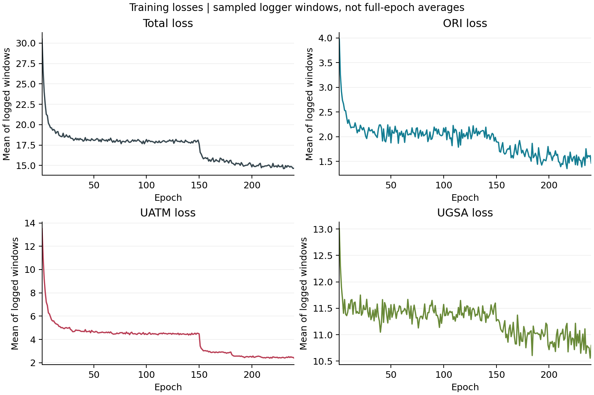

# Uncertainty-Guided Knowledge Distillation

## Results

### CIFAR-100

| Model | Teacher | Baseline Top-1 (%) | UATM + UGSA Top-1 (%) | Config | Weight | Log |
| :--- | :--- | :---: | :---: | :---: | :---: | :---: |
| ResNet8x4 | ResNet32x4 | Not provided | **77.20** | [config](configs/distillers/cifar100/ugkd/resnet32x4_resnet8x4.py) | [checkpoint notes](checkpoints/README.md) | [training log](results/cifar100/resnet32x4_resnet8x4/20260218_180916/train.log) |

Run ID: `20260218_180916`. Best and final accuracy: `77.19999694824219%` at epoch `240`, displayed as `77.20%`.

The summary contains one run with runtime seed `1618450972`. The original config sets `seed=None`; this seed is taken from the runtime log. Deterministic mode was disabled. No baseline improvement or mean/standard deviation is reported because the required experiments were not supplied. The teacher checkpoint filename includes `81.63`, but no teacher evaluation is provided to verify that value.

The MMEngine validation loop evaluates `CIFAR100(test_mode=True)` at every epoch. Therefore the selected score is a **best per-epoch test-split score**, not a result from a separate holdout validation split followed by independent testing.

## Configuration

| Setting | Value |
| :--- | :--- |
| Dataset | CIFAR-100 |
| Teacher / student | ResNet32x4 / ResNet8x4 |
| Epochs | 240 |
| Training batch size | 64 on one GPU |
| Optimizer | SGD, learning rate 0.05, momentum 0.9, weight decay 0.0005 |
| Learning-rate schedule | MultiStepLR; milestones 150, 180, 210; gamma 0.1 |
| ORI weight | 1.0 |
| UATM | Temperature 4.0; loss weight 15.0 |
| UGSA | KL; loss weight 1.0 |
| Crop / flip | 32x32 random crop, padding 4; horizontal flip probability 0.5 |
| Mixup | Alpha 0.4; configured probability 0.6 |
| CutMix | Alpha 1.0; configured probability 0.2 |
| Accuracy | Top-1, percentage |
| Runtime seed | 1618450972 |

The config also specifies `auto_scale_lr.base_batch_size=256`; this is a scaling reference, not the observed batch size. The logged initial learning rate is `0.05` and the log reports one GPU. The original normalization values, dataset paths, model references, and work directory remain in the copied config.

## Install

The original training log records:

| Component | Recorded value |
| :--- | :--- |
| Platform | Linux |
| Python | 3.8.20 |
| PyTorch | 1.11.0+cu113 |
| TorchVision | 0.12.0+cu113 |
| MMEngine | 0.7.4 |
| CUDA toolchain | 11.3 |
| OpenCV | 4.12.0 |
| GPU | NVIDIA GeForce RTX 4090 |

The exact MMClassification version and complete dependency list are unavailable. The reference [cls_KD 1.0](https://github.com/yzd-v/cls_KD/blob/1.0/README.md) documents its own environment; that environment has not been validated for this experiment.

## Train

The included Python config documents the recorded experiment. To provide a working training command, the following original files are still required:

- `ClassificationDistiller` and its registration.
- `ORILoss`, `UATMLoss`, and `UGSALoss` implementations and registrations.
- `projects/_models_/cifar100_resnet32x4.py`.
- `projects/_models_/cifar100_resnet8x4.py`.
- `weights/resnet32x4_81.63.pth`.
- Original training entry point and dependency specification.

These files are absent from the supplied results folder. See [projects/README.md](projects/README.md) for how to organize them when available.

## Transfer

The checkpoint contains both `teacher.*` and `student.*` parameter names. It is a full distillation checkpoint rather than an exported student-only model. No checkpoint conversion has been performed.

The reference project's transfer workflow is described in [cls_KD/nkd.md](https://github.com/yzd-v/cls_KD/blob/1.0/nkd.md). A corresponding UGKD export must use the original student model definition and verify the exported state dictionary before a student-only weight is advertised.

## Test

The recorded validation metrics are included, but no new model inference was run during organization. A standalone testing command depends on the original model code, compatible runtime, checkpoint loading convention, and test entry point.

## Training Curves

The loss curves show the unweighted mean of **logged windows** for each epoch. There are 1,680 training records, with seven logged windows per epoch. These are not exact full-epoch averages. The plots preserve the logged values without applying new loss weights or smoothing.

Dashed lines in the accuracy figure mark the configured learning-rate milestones. Figures are available as both PNG and PDF in [imgs](imgs/).

## Artifact Provenance

[source_manifest.json](results/cifar100/resnet32x4_resnet8x4/20260218_180916/source_manifest.json) lists all seven input files, their SHA-256 hashes, copied locations, and omitted duplicate copies. The original config, scalar records, log, and model weight are copied without editing their contents.

The timestamp-named scalar JSON duplicates `scalars.json`, and the notebook checkpoint duplicates the text log. Both duplicate copies are accounted for in the manifest. A configuration snapshot is retained next to the results for provenance.

[verification.json](results/cifar100/resnet32x4_resnet8x4/20260218_180916/verification.json) records checks on all 240 validation epochs, agreement between the text and scalar logs, checkpoint epoch, config syntax, and copied-file hashes. It does not certify training reproducibility or model inference.
